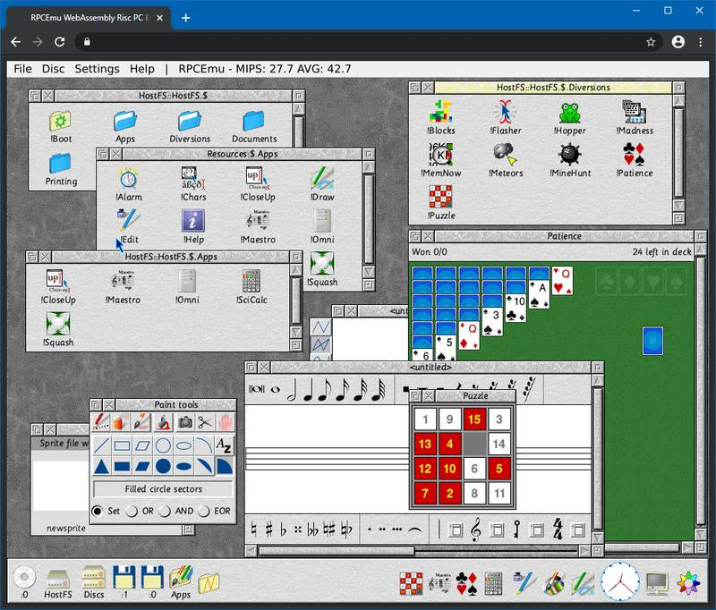

RPCEmu-WASM
===========

This is a WebAssembly port of the RPCEmu Risc PC Emulator.  It can run the following operating systems in your web browser:

- RISC OS 3.5, 3.6 and 3.7
- RISC OS 4
- RISC OS 5 -- actively developed for systems like the Raspberry Pi
- RISC OS Six

Try It!
-------

You can try RPCEmu in your browser [here](https://gmh-code.github.io/rpcemu/).  Please note that:

- The original mouse had three buttons.  Pressing the mouse wheel should act as the middle (menu) button.
- You can safely deny any webcam/microphone prompt(s).  This appears to be a standard for Qt when using multimedia.
- By default, your work is not saved if you leave the page.

Screenshot
----------

Here is RPCEmu-WASM running RISC OS 5 and a variety of applications in a web browser:

What's Working
--------------

- RPCEmu's core, including ARM610, ARM710, ARM7500, ARM7500FE and StrongARM SA-110 CPUs
- Video
- Audio
- Keyboard
- Mouse (uncaptured mode)
- Floppy/hard disk/CD-ROM images
- GUI

Networking may also partially work, but this is untested and switched off by default.

Minimum Browsers Supported
--------------------------

- Firefox 79
- Chrome 68
- Edge 79
- Safari 15.2
- Opera 64

Any other browsers that support multi-threaded WebAssembly should work.  Many modern mobile browsers based on these will also run the emulator, but the video may not be sized properly unless desktop mode is used.  A hardware keyboard and mouse/trackpad is also recommended.

Multi-Thread Information
------------------------

Note that the CPU, sound, video and RPCEmu's GUI are run in multiple threads to improve performance, but they share access to system RAM.  In multi-threaded WASM, this shared memory is emulated using a JavaScript `SharedArrayBuffer`, so a single browser tab can run more than one thread in parallel.  This JavaScript feature is a RPCEmu-WASM requirement, and using it can result in high CPU usage.

Features Unique to this Version
-------------------------------

- RPCEmu-WASM runs entirely in WebAssembly, but the build process can still construct native apps in Linux and Windows.
- The Qt version has been upgraded from the version 5 range to 6.5.
- You can upload individual files to HostFS in the same way you load disk images.  This offers a quick way to load modules or upload simple files.
- You can 'upload' ADF floppy disk and ISO CD-ROM images to the emulator as it runs.
- The screenshot feature can 'download' the screenshot to your local storage.
- You can attach HostFS to the browser's IndexedDB instead of just using the in-memory filesystem, which offers a limited way to keep data between sessions.  At present, the CMOS, config, or IDE disc images are not included.

Boot Sequence
-------------

This emulator boots from ROM images like many others, but to save on download size, the standard !Boot sequence is *not* installed by default.

To configure the system's CMOS to boot from a !Boot sequence placed on HostFS, press F12 to enter the CLI and run these commands:

    configure filesystem hostfs
    configure boot

Press return to the `*` prompt to exit.  You will then need to shut down and restart the OS by clicking *File > Reset* in the emulator's menu bar.

ROM Support
-----------

Due to licence restrictions, I only recommend using RISC OS 5 with RPCEmu-WASM.  RISC OS 5 is the same version used on the Raspberry Pi, and the Risc PC version is freely available from [RISC OS Open Limited](https://www.riscosopen.org).  Other versions (such as those based on RISC OS 3.x) can still be purchased, so I would not recommend using them on a public server.  In any case, you should obtain your own legal advice.

To run RISC OS 3.x applications, use the following tools:

- Aemulor - Allows you to run 26-bit applications on 32-bit systems.  This compatibility layer can also emulate RISC OS 3.1 behaviour.
- ADFFS - Mounts non-standard (e.g. protected) floppy disks inside the emulator by imaging the disk and replaying I/O calls as though it was a proper disk controller.

Known Issues
------------

These are problems which are specific to RISC OS 5, but *not* RISC OS 3.7.  They also occur on the desktop version of RPCEmu:

- Clicking a floppy drive icon without a disk in the drive results in the misleading message `Disc not formatted` instead of `Drive empty`.
- Clicking the CD-ROM drive results in `CD-ROM drive not found` even if an ISO file is selected.
- IDE discs (native hard disks) are untested, however these are unnecessary if the HostFS filesystem is used.
- Only the instruction interpreter is supported, not the recompiler.  However, should a suitable *ARM-to-WASM* recompiler ever be built, it should be extremely fast!

Building from Source -- Desktop
-------------------------------

If you want to build the Windows, Linux or FreeBSD desktop versions of RPCEmu, this version will do that, but you will need Qt 6.5 instead of Qt 5.  See [https://www.marutan.net/rpcemu/](https://www.marutan.net/rpcemu/) for instructions on how to build the desktop version of RPCEmu.

Building from Source -- WebAssembly
-----------------------------------

This version of RPCEmu has been designed to build WebAssembly code in a similar way to native desktop apps:

- Download, install and activate Emscripten 3.1.25, and set the environment variables as per the on-screen instructions.
- Download and install Qt 6.5.  In the Qt Setup ('Maintenance Tool') program, ensure you tick *WebAssembly (multi-threaded)*.

Follow the desktop build instructions, noting:

- Ensure `qmake`'s binary is the version from the `wasm_multithread` folder instead of `gcc_64`.
- After running `qmake`, run `make` to build the *Release* version.  The HTML/JS/WASM/data files and worker script will be output into the main source folder.
